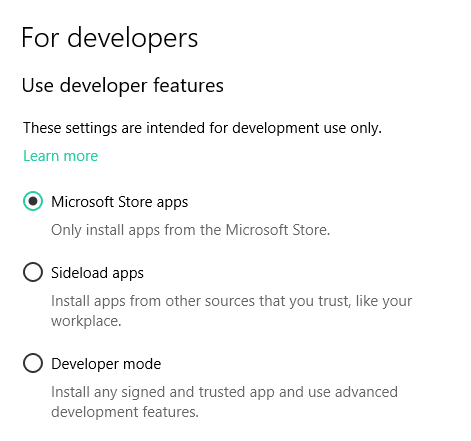
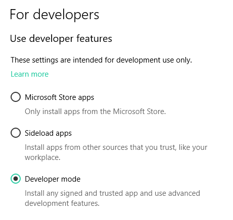
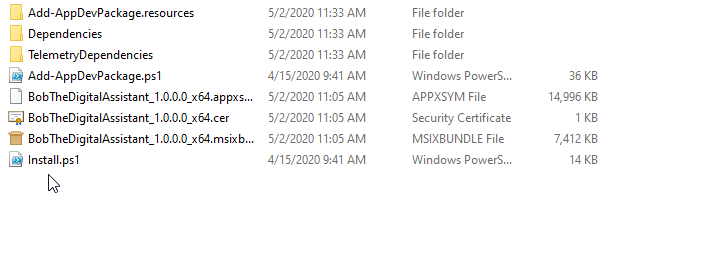
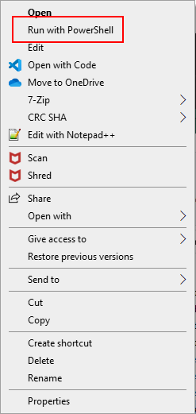

# Installation Instructions
To install Bob, first you need to enable developer mode on your machine, to do this, click <a href="ms-settings:developers">this link</a> or press <kbd>win</kbd> + <kbd>r</kbd>, type `ms-settings:developers`, and then press enter. After you do either of these, you should see a section like this at the top of the page:
 

 
Select the third option, and click "yes" on the prompt that shows. That prompt is Microsoft making sure that you know what you're doing, and in order to install Bob you must click "yes".
 

After you do that, you need to download the zip file linked on this site's home screen (or from <a href="https://github.com/ploiu/Bob/releases/download/v1.0.1/InstallFiles.zip" download="bobSetup.zip">here</a>), go to where the zip file was downloaded and unzip it in file explorer. After that, double click on the folder to enter into it. If you're in the right place, you should see something like this:
 

We're about to run a powershell script in that folder, so this next part is very important: <strong>Powershell can be very dangerous, especially in a situation like this where you'll be running a powershell script that came from someone else. Do <em>NOT</em> blindly trust powershell scripts.</strong> If you want to look at what is in the script, you can right-click on it, and select "edit" from the popup menu that appears.
 
Once you're in the folder, right click on the <code style="display: inline">install.ps1</code> file, navigate to where it says "run with powershell", and select it. 
 

 
A dark-blue window should show up with some text asking if you really want to run the script (If you've already done this before, it may not ask). Type in `Y` and hit enter. After that, the setup should take under a minute and Bob will be installed on your device! Hooray!
